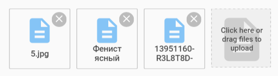

#    Document attachment controls

Electronic documents are used a lot in enterprise. Ability to attach documents to any item in application is a great feature that can enhance user experience. Pip.WebUI.Documents module contains two controls to add/remove and visualize document attachments. It relies on **files** operations in standard REST API.

### Document list view

**Document list view** control shows a list of attached documents. It allows users to download the document by clicking on it.

### Document list edit

**Document list edit** control allows to attach files or remove them from the document list.

## Learn more about the module

- [User's guide](doc/UsersGuide.md)
- [Online samples](http://webui.pipdevs.com/pip-webui-documents/index.html)
- [API reference](http://webui-api.pipdevs.com/pip-webui-documents/index.html)
- [Developer's guide](doc/DevelopersGuide.md)
- [Changelog](CHANGELOG.md)
- [Pip.WebUI project website](http://www.pipwebui.org)
- [Pip.WebUI project wiki](https://github.com/pip-webui/pip-webui/wiki)
- [Pip.WebUI discussion forum](https://groups.google.com/forum/#!forum/pip-webui)
- [Pip.WebUI team blog](https://pip-webui.blogspot.com/)

## Module dependencies

* [pip-webui-lib](https://github.com/pip-webui/pip-webui-lib): angular, angular material and other 3rd party libraries
* [pip-webui-css](https://github.com/pip-webui/pip-webui-css): CSS styles and web components
* [pip-webui-core](https://github.com/pip-webui/pip-webui-core): localization and other core services
* [pip-webui-rest](https://github.com/pip-webui/pip-webui-rest): REST resource for files

## License

This module is released under [MIT license](License) and totally free for commercial and non-commercial use.
