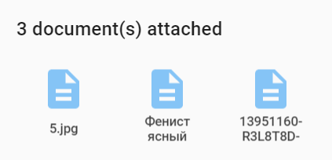
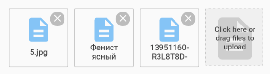

# Pip.WebUI.Documents User's Guide

## <a name="contents"></a> Contents
- [Installing](#install)
- [pip-documents-list](#documents_list)
- [pip-documents-list-edit](#documents_list_edit)
- [Questions and bugs](#issues)


## <a name="install"></a> Installing

Add dependency to **pip-webui** into your **bower.json** or **package.json** file depending what you use.
```javascript
"dependencies": {
  ...
  "pip-webui": "*"
  ...
}
```

Alternatively you can install **pip-webui** manually using **bower**:
```bash
bower install pip-webui
```

or install it using **npm**:
```bash
npm install pip-webui
```

Include **pip-webui** files into your web application.
```html
<link rel="stylesheet" href=".../pip-webui-lib.min.css"/>
<link rel="stylesheet" href=".../pip-webui.min.css"/>
...
<script src=".../pip-webui-lib.min.js"></script>
<script src=".../pip-webui.min.js"></script>
```

Register **pipDocuments** module in angular module dependencies.
```javascript
angular.module('myApp',[..., 'pipDocuments']);
```


## <a name="documents_list"></a> pip-documents-list

**pip-documents-list** control shows a list of attached documents. By clicking on the document user is able to download it to his computer.

### Usage
Todo: Add code snippet with the directive and its attributes



### Attributes
Todo: Document the directive attributes


## <a name="documents_list_edit"></a> pip-documents-list-edit

**pip-documents-list-edit** control allows editing of document attachments. Files can be added to the list or removed from it.

### Usage
Todo: Add code snippet with the directive and its attributes



### Attributes
Todo: Document the directive attributes


## <a name="issues"></a> Questions and bugs

If you have any questions regarding the module, you can ask them using our 
[discussion forum](https://groups.google.com/forum/#!forum/pip-webui).

Bugs related to this module can be reported using [github issues](https://github.com/pip-webui/pip-webui-documents/issues).
